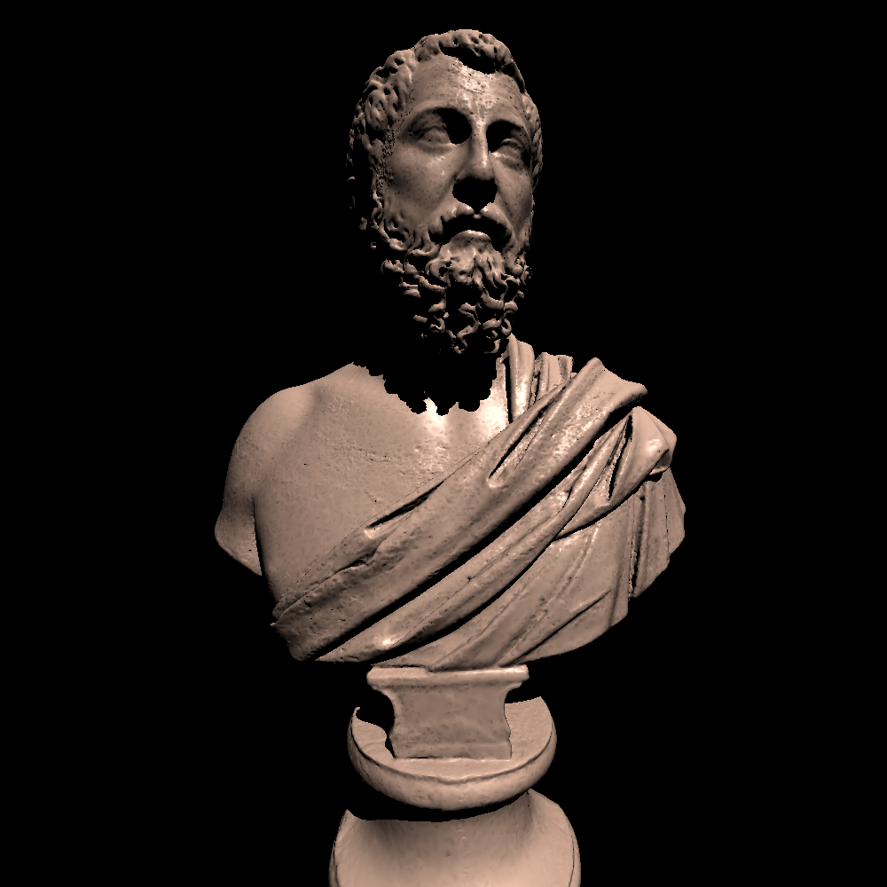
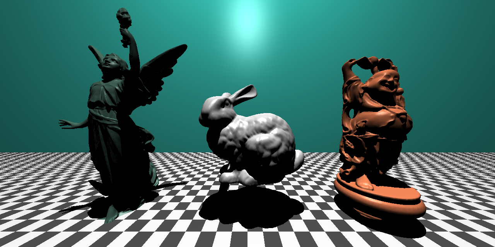

# cpptracer

2.3Million Triangles in scene above, 60 Million pixels

---------------------

500k triangles in scene below

refraction working

~300k triangles in these scenes below

TODO:
- Soft shadows
- Speedup and optimasation
- BVH maybe