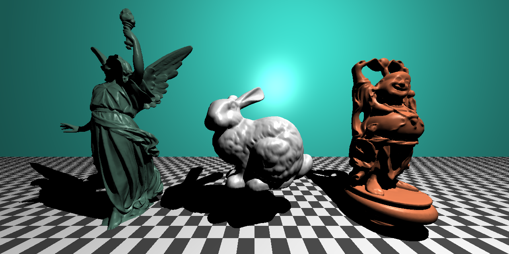
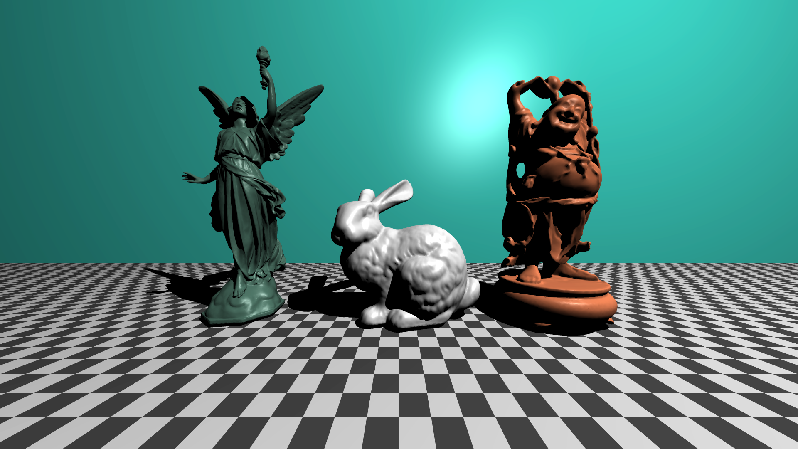

# cpptracer

500k triangles in scene above

~300k triangles in these scenes below

upscaled

down scaled above image with SSAA

TODO:
- Soft shadows??  
- Materials mainly metals and glass  
- Eventually Refraction and Reflection  
