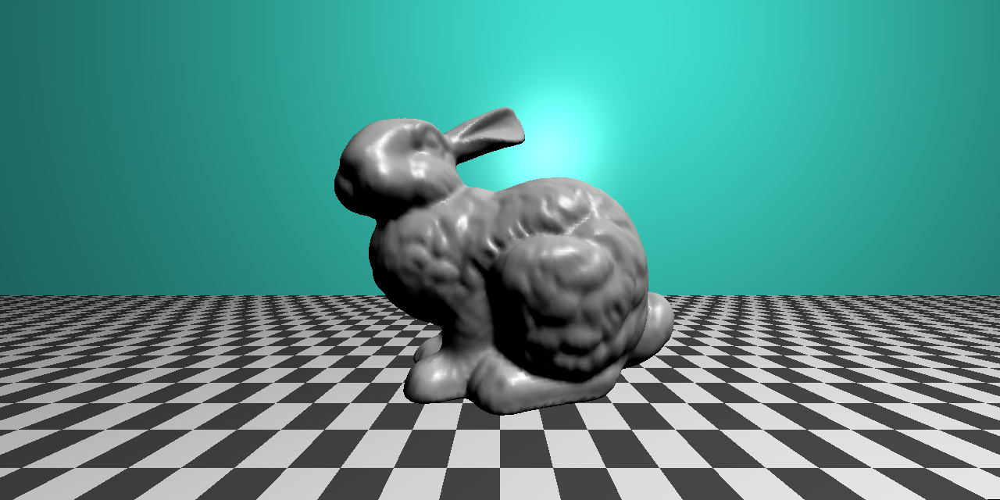
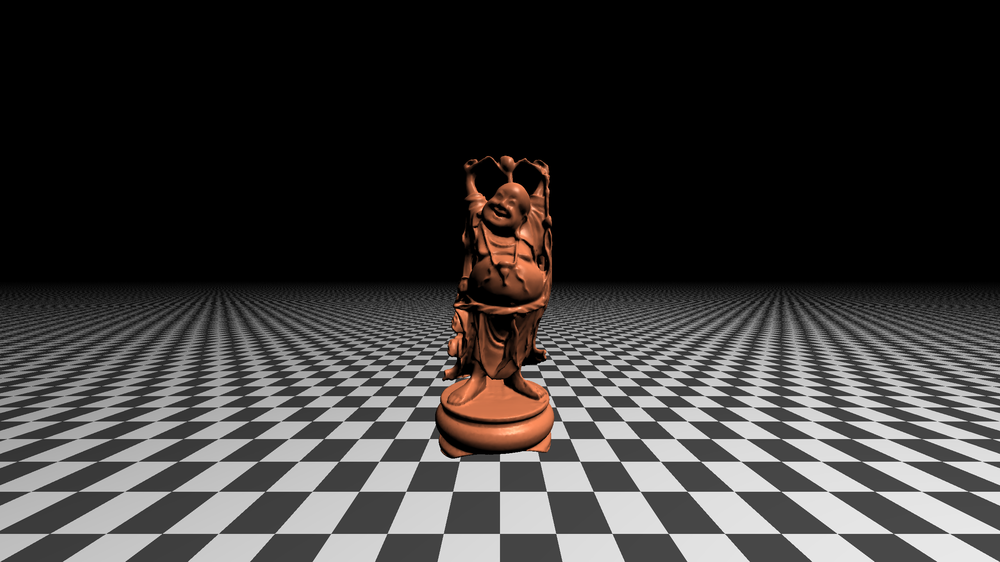
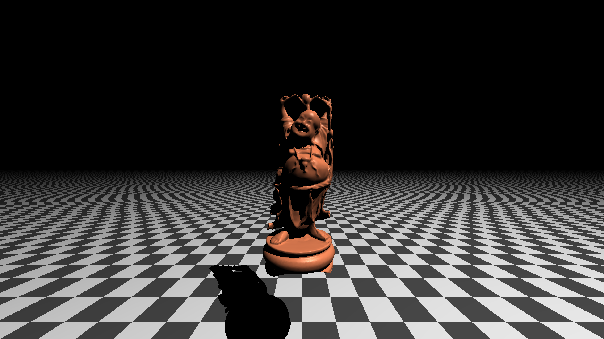
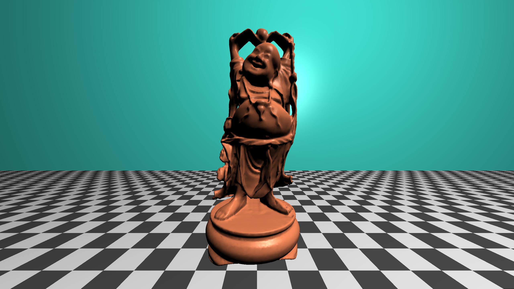

# cpptracer

Simple bunny (4968 faces)

All images below have 98601 faces, made faster with an self implemented Octree, 2k quality (2560x1440p)

No shadows

With shadows

With a background no shadows

TODO:
- Fast shadows  
- Soft shadows??  
- Materials mainly metals and glass  
- Eventually Refraction and Reflection  
