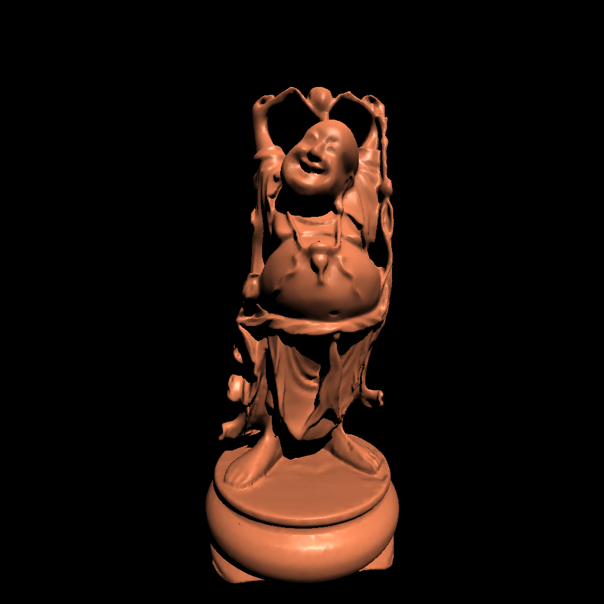
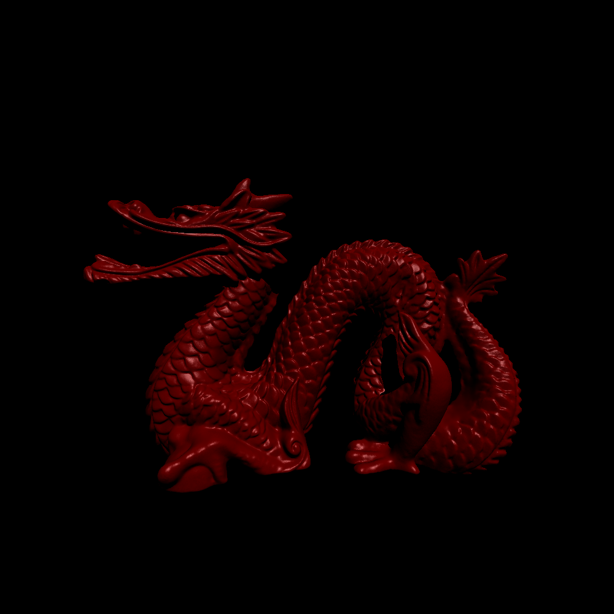
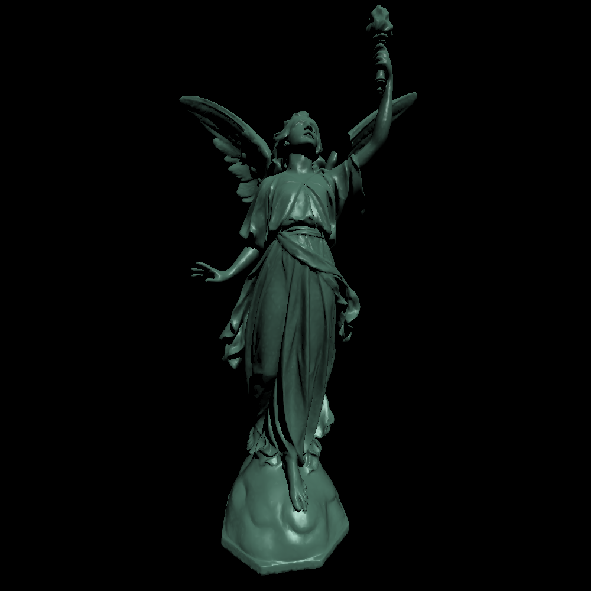

# Nymph (990002 triangles)
   
 - rotation: (0, 0, 0)   
 - colour: (255, 255, 255)   

# Bust of a Rhetorican (500000 triangles)
   
 - rotation: (0, PI/2, -PI/4)   
 - colour: (228, 186, 163)   

# Happy Buddha (98600 triangles)
   
 - rotation: (0, 0, 0)   
 - colour: (252, 140, 92)   

# Dragon (2349078 triangles)
   
 - rotation: (0, PI/2, 0)   
 - colour: (102, 0, 0)   

# Lucy (99970 triangles)
   
 - rotation: (0, PI/2, PI)   
 - colour: (78, 117, 102) 

------------------